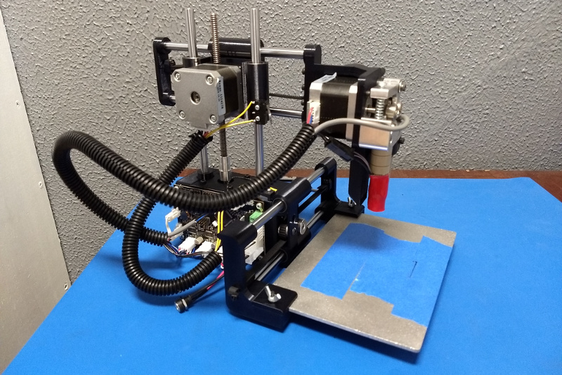

# Adoptabot v1
These are individual STL files for each of the printed parts of the v1 [Adoptabot](www.adoptabot.com).

Files in the "experimental" directory are my modifications of the original files, and are not guaranteed to work as expected.

# Print Settings
All parts except case printed at 50% infill with .2mm layers, case printed with .3mm layers.

# License
This project is released under the [Attribution-ShareAlike 4.0 License](https://creativecommons.org/licenses/by-sa/4.0/).

You are free to:

* **Share** — copy and redistribute the material in any medium or format
* **Adapt** — remix, transform, and build upon the material
* The licensor cannot revoke these freedoms as long as you follow the license terms.

Under the following terms:

* **Attribution** — You must give appropriate credit to all contributors to this project, provide a link to the license, and indicate if changes were made. You may do so in any reasonable manner, but not in any way that suggests the licensor endorses you or your use.

* **ShareAlike** — If you remix, transform, or build upon the material, you must distribute your contributions under the same license as the original.

**Notice:** You do not have to comply with the license for elements of the material in the public domain or where your use is permitted by an applicable exception or limitation.
No warranties are given. The license may not give you all of the permissions necessary for your intended use. For example, other rights such as publicity, privacy, or moral rights may limit how you use the material.
