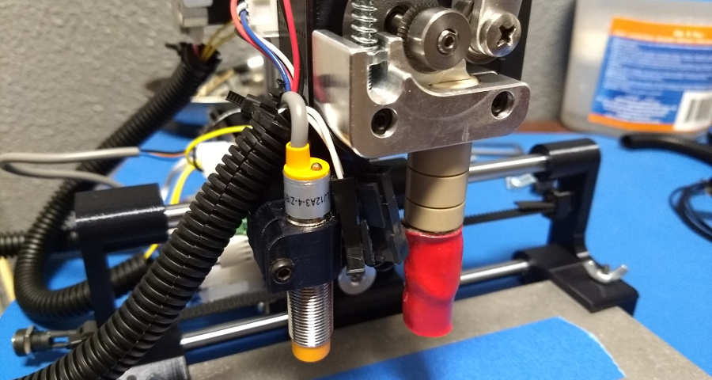

# Experimental Modifications
The files in this directory are experimental modifications I have made to the core Adoptabot files. They may or may not work as expected.

# Changes
* Induction sensor moved to separate arm off of extruder mount.

# Notes
To prevent induction sensor from hitting left bed clamp during auto-level, change the sensor Y offset to 5mm using M212.
